Manual for the use of the RCM functions
=======================================

Install and load packages
-------------------------

This repo contains R-code to fit and plot the RC(M)-models augmented with the negative binomial. The functions used for simulation but which are outside outside the core RC(M) algorithm are present in the "pubFun" folder.

The package can be installed using the following commands:

``` r
library(devtools)
install_github("CenterForStatistics-UGent/RCM")
library(RCM)
cat("RCM package version", as.character(packageVersion("RCM")), "\n")
library(phyloseq)
```

Dataset
-------

As example data we use a study on the microbiome of colorectal cancer patients "Potential of fecal microbiota for early-stage detection of colorectal cancer" (2014) by Zeller *et al.*.

``` r
data(Zeller)
```

The *Zeller* object is a phyloseq object, which contains all the information of a microbiome experiment. The *RCM* package is tailor-made for phyloseq objects. More information on building the phyloseq object can be found at .

Unconstrained RCM
-----------------

### Fitting the unconstrained RCM

The unconstrained RC(M) method represents all variability present in the data, regardless of covariate information. It should be used as a first step in an exploratory analysis. The *RCM* function is the front end function for this purpose, behind it is the *RCM\_NB* function that does the hard work but requires numeric matrix imputs. We first fit a model with two dimensions,

``` r
if (!file.exists(file = "./results/ZellerRCM2.RData")) {
    ZellerRCM2 = RCM(Zeller, k = 2, round = TRUE)
    save(ZellerRCM2, file = "./results/ZellerRCM2.RData")
} else {
    load(file = "./results/ZellerRCM2.RData")
}
```

which took 0.8 minutes. Here we supplied a phyloseq object to the RCM function which is preferable. Alternatively one can also provide a count matrix with samples in the rows and taxa in the columns, but then all plotting variables should be supplied manually as vectors.

#### Adding dimensions

Since the model is fitted dimension per dimension, we only have information on the first two dimension. If we want to add a third dimension, we do not have to start from scratch but can use the previously fitted model in two dimension as a starting point and additionally estimate the third dimension. The result is identical as when the three dimensional model had been fitted from scratch.

``` r
if (!file.exists(file = "./results/ZellerRCM3.RData")) {
    ZellerRCM3 = RCM(Zeller, prevFit = ZellerRCM2, k = 3, round = TRUE)
    save(ZellerRCM3, file = "./results/ZellerRCM3.RData")
} else {
    load(file = "./results/ZellerRCM3.RData")
}
```

The total runtime for all dimensions combined was 2.3 minutes.

#### Conditioning

In order to condition on certain variables, supply their names to the *confounders* argument. Here we condition on the *country* variable

``` r
if (!file.exists(file = "./results/ZellerRCM2cond.RData")) {
    ZellerRCM2cond = RCM(Zeller, k = 2, round = TRUE, confounders = c("Country"))
    save(ZellerRCM2cond, file = "./results/ZellerRCM2cond.RData")
} else {
    load(file = "./results/ZellerRCM2cond.RData")
}
```

Conditioning can be applied for unconstrained as well as constrained RCM, the ensuiing plots have exactly the same interpretation save for the conditioning.

### Plotting the uconstrained RCM

#### Monoplots

To plot only samples or taxa, specify the *plotType* argument in the generic *plot* function.

``` r
plot(ZellerRCM2, plotType = "samples")
```

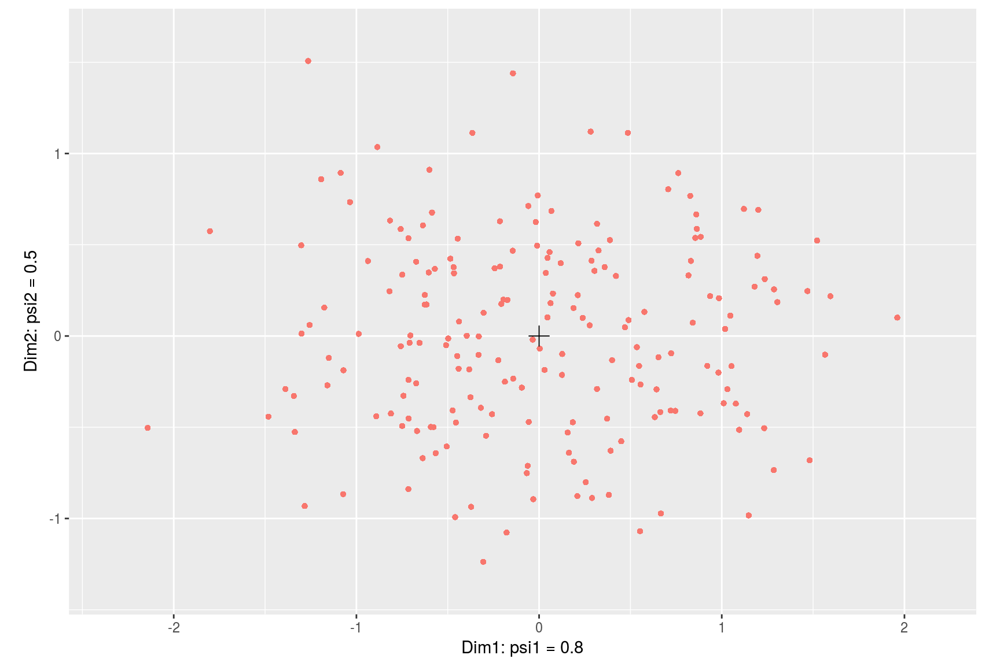

No clear signal is present at first sight. Note also that the plot is rectangular according to the values of the importance parameters *ψ*. In order to truthfully represent the distances between samples all axis must be on the same scale. We can add a colour code for the cancer diagnosis contained in the phyloseq object.

``` r
plot(ZellerRCM2, plotType = "samples", samColour = "Diagnosis")
```

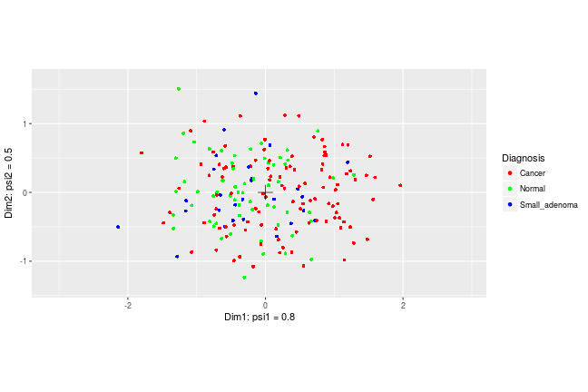

It is clear that some of the variability of the samples is explained by the cancer status of the patients.

We can also add a richness measure as a colur, see ?phyloseq::estimate\_richness for a list of available richness measures. Here we plot the Shannon diversity

``` r
plot(ZellerRCM2, plotType = "samples", samColour = "Shannon")
```

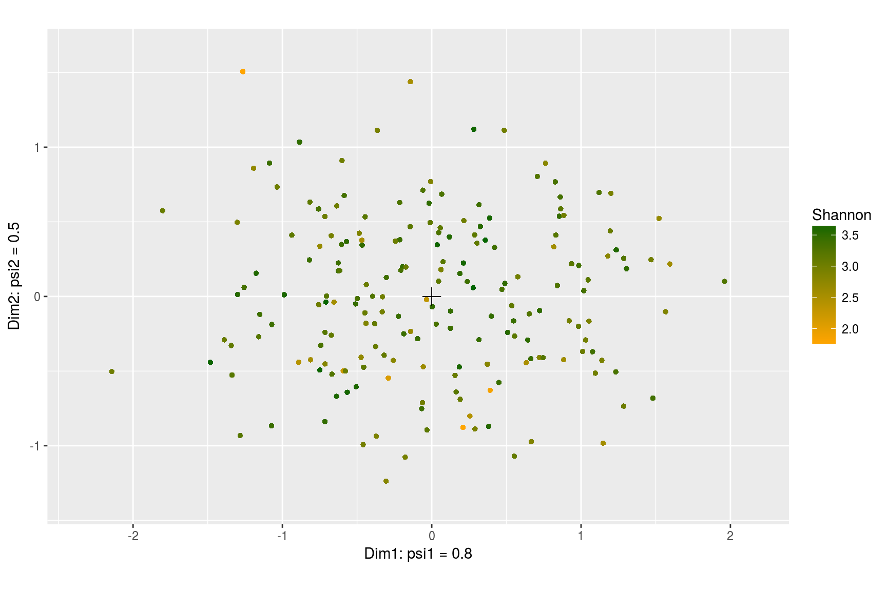

In order to plot only the species, modify the *plotType* argument.

``` r
plot(ZellerRCM2, plotType = "species")
```

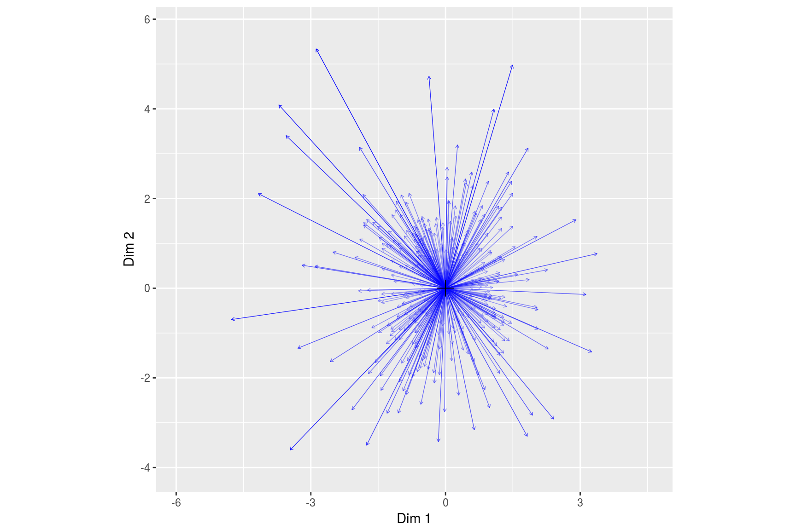

The researchers found that species from the Fusobacteria genus are associated with cancer. We can plot only these species using a regular expression.

``` r
plot(ZellerRCM2, plotType = "species", taxRegExp = "Fusobacter", taxLabels = TRUE)
```


It is clear that these Fusobacterium species behave very differently between the species. We can also colour the species plots by phylogenetic level, e.g. order level, if available in the dataset.

``` r
plot(ZellerRCM2, plotType = "species", taxLabels = TRUE, taxCol = "Order")
```

#### Biplots

Finally we can combine both plots into an interpretable biplot, which is the default for unconstrained RC(M). To avoid overplotting we only show the taxa with the 10 most important departures from independence.

``` r
plot(ZellerRCM2, taxNum = 10, samColour = "Diagnosis")
```

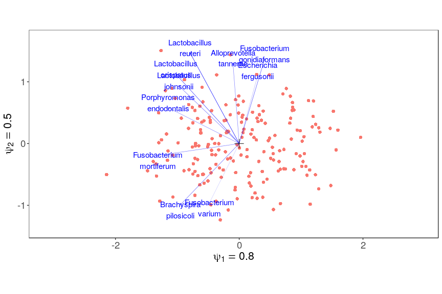

Samples are represented by dots, taxa by arrows. Both represent vectors with the origin as starting point.

Valid interpretatations are the following:

-   Samples (endpoints of sample vectors, the red dots) close together depart from independence in a similar way
-   The orthogonal projection of the taxon arrows on the sample arrows are proportional to the departure from independence of that taxon in that sample on the log scale, in the first two dimensions. For example Fusobacterium mortiferum is more abundant than average in samples on the left side of the plot, and more abundant in samples on the right side.
-   The importance parameters *ψ* shown for every axis reflect the relative importance of the dimensions

Distances between endpoints of taxon vectors are meaningless.

##### Adding projections

We can also graphically highlight the departure from independence for a particular taxon and sample using the *addOrthProjection* function:

``` r
tmpPlot = plot(ZellerRCM2, taxNum = 10, samColour = "Diagnosis", returnCoords = TRUE)
addOrthProjection(tmpPlot, species = "Alloprevotella tannerae", sample = c(-1.2, 
    1.5))
```

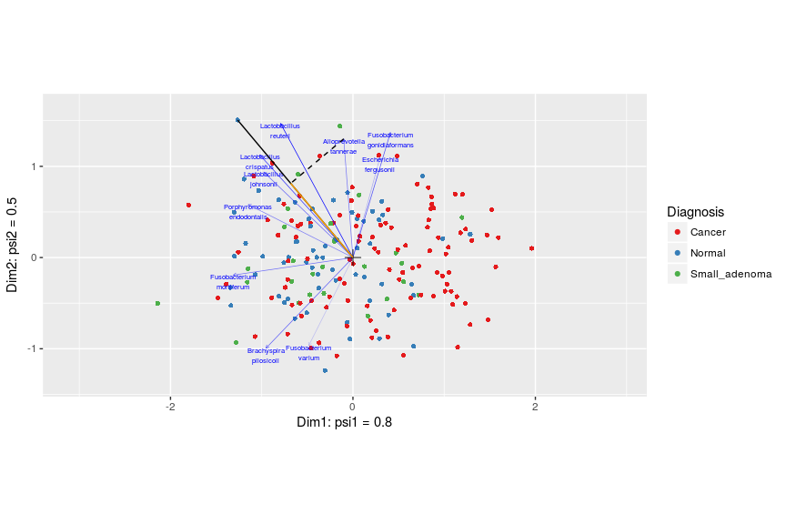

The projection of the species vector is graphically shown here, the orange bar representing the extent of the departure from independence. Note that we providid the exact taxon name, and approximate sample coordinates visually derived from the graph, but any combination of both is possible.

We can then plot any combination of two dimensions we want, e.g. the first and the third.

``` r
plot(ZellerRCM3, Dim = c(1, 3), samColour = "Diagnosis", taxNum = 6)
```

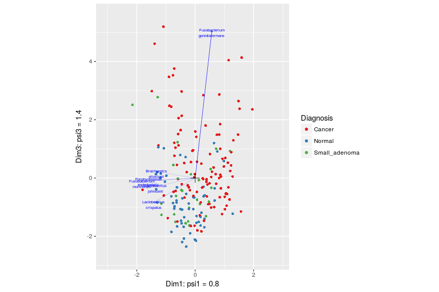

The third dimension also correlates with a separation of cancer patients vs. healthy and small adenoma patients.

### Assessing the goodness of fit

Some taxa (or samples) may not follow a negative binomial distribution, or their departures from independence may not be appropriately represented in low dimensions. We visualize these taxa and samples through their deviances, which are the squared sums of their deviance residuals. This allows us to graphically identify taxa and samples that are poorly represented in the current ordination.

The deviances per sample can be plotted by just supplying the argument "Deviance" to *samColour*

``` r
plot(ZellerRCM2, plotType = "samples", samColour = "Deviance", samSize = 2.5)
```

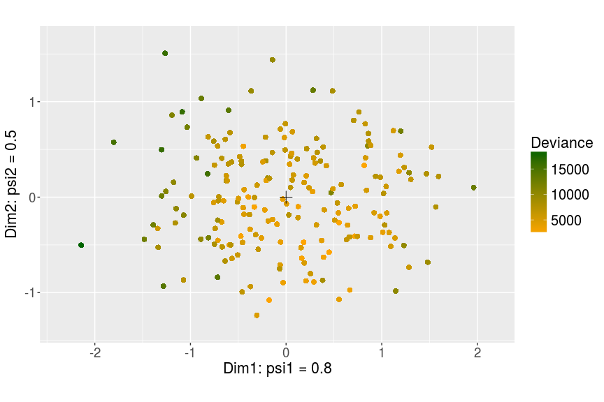

Samples with the largest scores exhibit the poorest fit. This may indicate that samples with strong departures from independence acquire large scores, but still are not well represented in lower dimensions. Especially the one bottom right may be a problematic case.

The same principle can be applied to the taxa

``` r
plot(ZellerRCM3, plotType = "species", taxCol = "Deviance", samSize = 2.5, Dim = c(1, 
    2), arrowSize = 0.5)
```

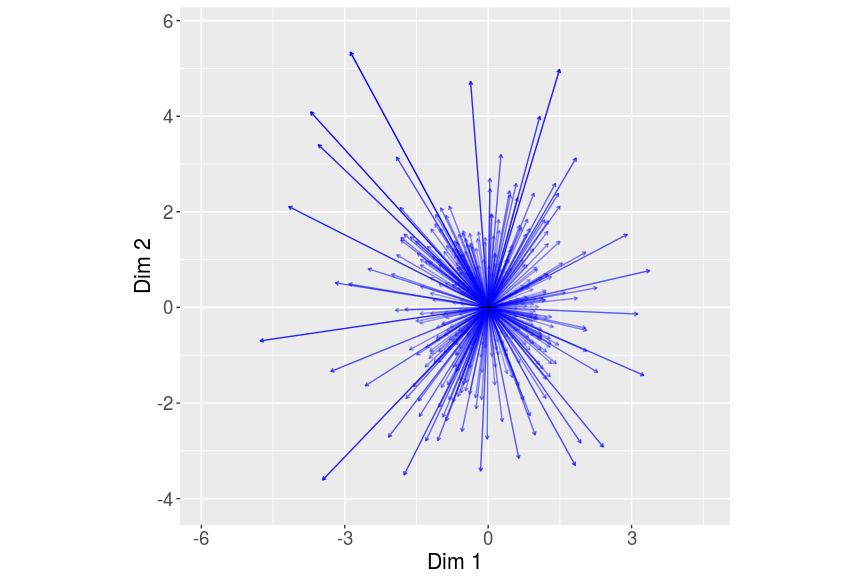

For the taxa it appears to be the taxa with smaller scores are the more poorly fitted ones. Note that since the count table is not square, we cannot compare sample and taxon deviances. They have not been calculated based on the same number of taxa. Also, one cannot do chi-squared tests based on the deviances since this is not a classical regression model, but an overparametrized one.

Constrained RCM
---------------

In this second step we look for the variability in the dataset explained by linear combinations of covariates that maximally separate the niches of the species. This should be done in a second step, and preferably only with variables that are believed to have an impact on the species' abundances. Here we used the variables age, gender, BMI, country and diagnosis in the gradient. In this analysis all covariates values of a sample are projected onto a single scalar, the environmental score of this sample. The projection vector is called the environmental gradient, the magnitude of its components reveals the importance of each variable. The taxon-wise response functions then describe how the logged mean abundance depends on the environmental score.

### Fitting the constrained RCM model

In order to request a constrained RCM fit it suffises to supply the names of the constraining variables to the *covariates* argument. The shape of the response function can be either "linear", "quadratic" or "nonparametric" and must be provided to the *responseFun* argument. Here we illustrate the use of linear and nonparametric response functions. Linear response functions may be too simplistic, they have the advantage of being easy to interpret (and plot). Non-parametric ones (based on splines) are more flexible but are harder to plot.

``` r
# Linear
if (!file.exists(file = "./results/ZellerRCM2constr.RData")) {
    ZellerRCM2constr = RCM(Zeller, k = 2, round = TRUE, covariates = c("Age", 
        "Gender", "BMI", "Country", "Diagnosis"), responseFun = "linear")
    save(ZellerRCM2constr, file = "./results/ZellerRCM2constr.RData")
} else {
    load(file = "./results/ZellerRCM2constr.RData")
}
# Nonparametric
if (!file.exists(file = "./results/ZellerRCM2constrNonParam.RData")) {
    ZellerRCM2constrNonParam = RCM(Zeller, round = TRUE, k = 2, covariates = c("Age", 
        "Gender", "BMI", "Country", "Diagnosis"), responseFun = "nonparametric")
    save(ZellerRCM2constrNonParam, file = "./results/ZellerRCM2constrNonParam.RData")
} else {
    load(file = "./results/ZellerRCM2constrNonParam.RData")
}
```

### Plotting the constrained RCM model

#### Monoplots

As before we can make monoplots of only samples or taxa. Starting with the samples

``` r
plot(ZellerRCM2constr, plotType = c("samples"))
```

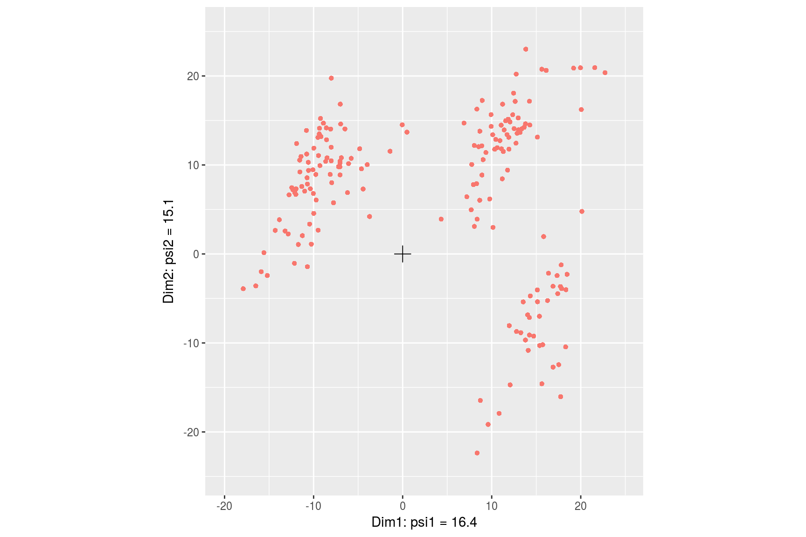

we clearly see three groups of samples appearing.

``` r
plot(ZellerRCM2constr, plotType = c("samples"), samColour = "Diagnosis", samShape = "Country")
```


One group are the healthy patients, the other two are cancer patients. The cancer patients are separated by country. Note that from Germany there are only cancer patients in this dataset. We can make the same monoplot of samples for the non-parametric response functions.

``` r
plot(ZellerRCM2constrNonParam, plotType = "samples", samColour = "Diagnosis")
```

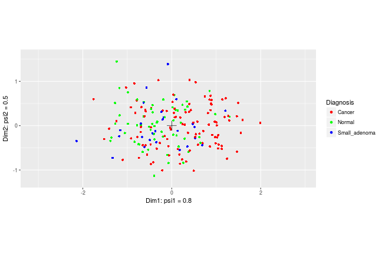

Unique to the constrained ordinations are monoplots of the variables

``` r
plot(ZellerRCM2constr, plotType = "variables")
```

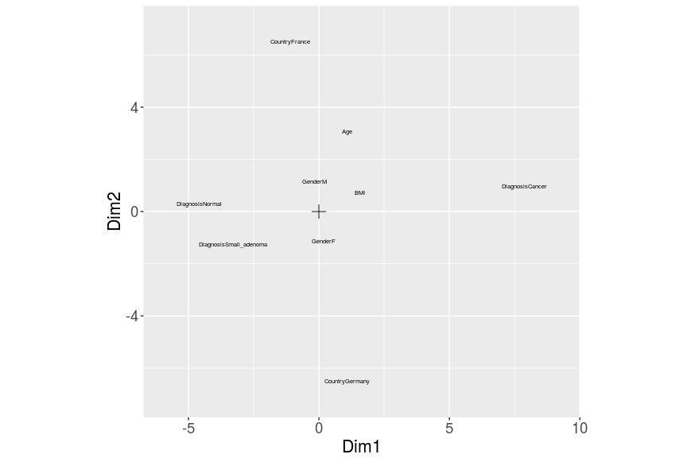

Variables far away from the origin have a strong role in shaping the environmental gradient.

``` r
plot(ZellerRCM2constrNonParam, plotType = "variables")
```

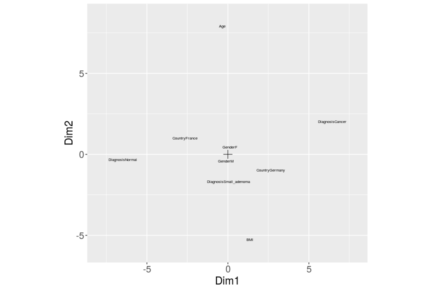

The envrionmental gradients are quite different from the case with the linear response functions. Especially age is an important driver of the environmental gradient here. Still the results for cancer diagnosis, country and gender are similar to before.

#### Biplots

In the constrained case two different biplots are meaningful: sample-taxon biplots and variable-taxon biplots.

##### Sample-taxon biplot

``` r
plot(ZellerRCM2constr, plotType = c("species", "samples"))
```

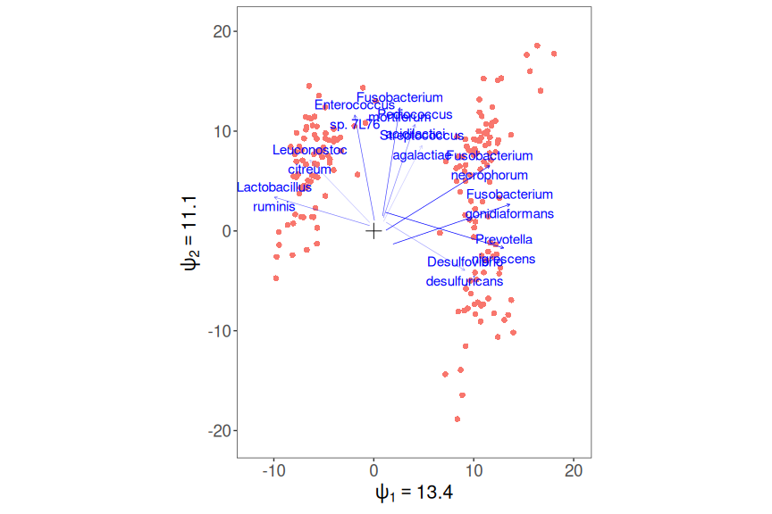

The interpretation is similar as before: the orthogonal projection of a taxon's arrow on a sample represents the departure from independence for that taxon in that sample, *explained by environmental variables*. New is also that the taxa arrows do not start from the origin, but all have their own starting point. This starting point represents the environmental scores for which there is no departure from independence. The direction of the arrow then represents in which direction of the environmental gradient its expected abundance increases. Again we can show this projection visually:

``` r
tmpPlot2 = plot(ZellerRCM2constr, plotType = c("species", "samples"), returnCoords = TRUE)
addOrthProjection(tmpPlot2, species = "Pseudomonas fluorescens", sample = c(-12, 
    7))
```

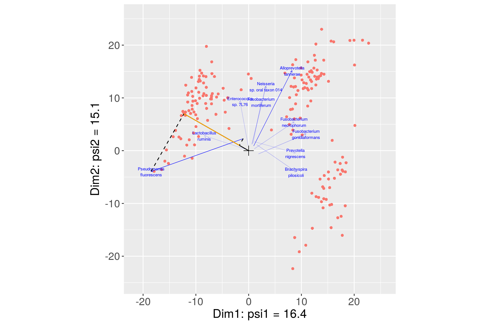

Note that the projection bar does not start from the origin in this case either.

##### Variable-taxon biplot

``` r
plot(ZellerRCM2constr, plotType = c("species", "variables"))
```

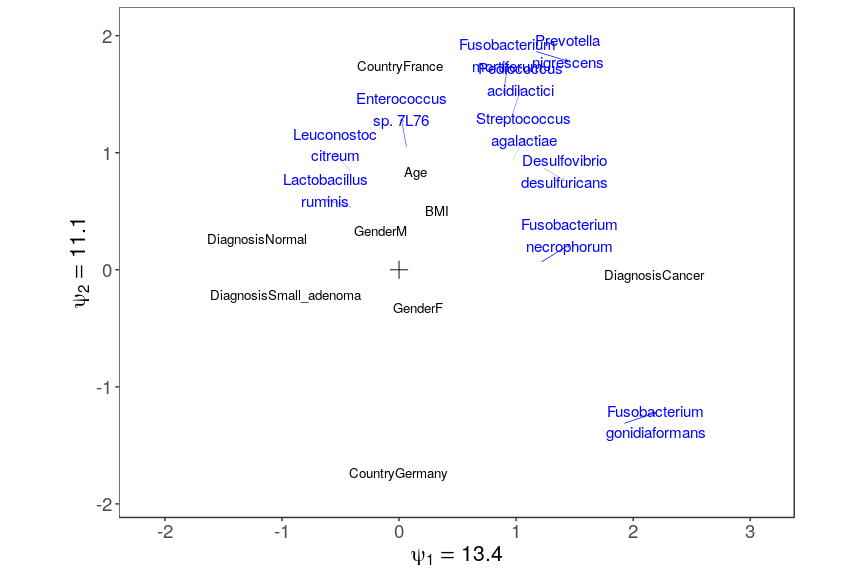

The projection of species arrows on environmental variables (starting from the origin) represents the sensitivity of this taxon to changes in this variables. Note that the fact that the arrows of BMI and gender are of similar length indicates that one *standard deviation* in BMI has a similar effect to gender.

Also this interpretation we can show visually on the graph

``` r
tmpPlot3 = plot(ZellerRCM2constr, plotType = c("species", "variables"), returnCoords = TRUE)
addOrthProjection(tmpPlot3, species = "Pseudomonas fluorescens", variable = "DiagnosisSmall_adenoma")
```

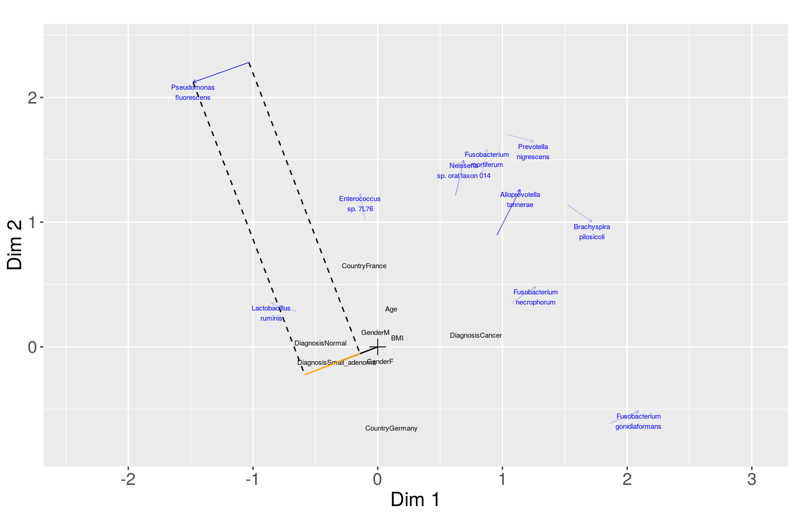

We observe that country and diagnosis are the main drivers of the environmental gradient. We also see that the healthy status has a very similar to the small adenoma status, but that they are very different from cancer patients.

#### Triplot

Triplots combine all the three components in a single plot. This is the default behaviour of the *plot* function.

``` r
plot(ZellerRCM2constr)
```

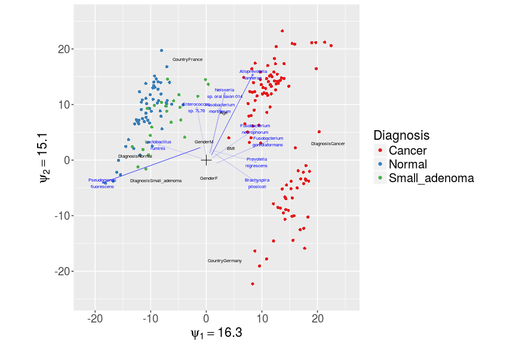

Note that the samples and the environmental variables cannot be related to each other, but the sample-taxon and variable-taxon relationships discussed before are still valid on the triplot.

For the non-parametric response functions we can only plot one dimensional triplots, whereby the shape of the response functions of the most strongly reacting taxa is shown. For this we use the *plotRespFun* function.

``` r
plotRespFun(ZellerRCM2constrNonParam, taxa = NULL, subdivisions = 50L, yLocVar = c(-30, 
    -50, -75, -62.5, -30, -62.5, -70, -50, -30) * 0.225, Palette = "Set1", angle = 90, 
    yLocSam = -20, axisTitleSize = 16, axisLabSize = 11, legendTitleSize = 18, 
    legendLabSize = 12, samShape = "Diagnosis", labSize = 5)
```

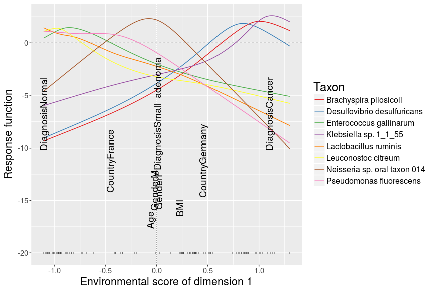

The first dimension is shown by default, the environmental scores of the samples are shown below as dots, the y-axis shows the response functions of the 8 most reacting species, whereby the x-axis represents the independence model.

Let us have a look at how *Fusobacterium* species react to this gradient, as the authors found them to be more abundant in cancer patients .

``` r
FusoSpecies = grep("Fusobacterium", value = TRUE, taxa_names(ZellerRCM2constrNonParam$physeq))
plotRespFun(ZellerRCM2constrNonParam, Dim = 1, taxa = FusoSpecies, samShape = "Diagnosis")
```

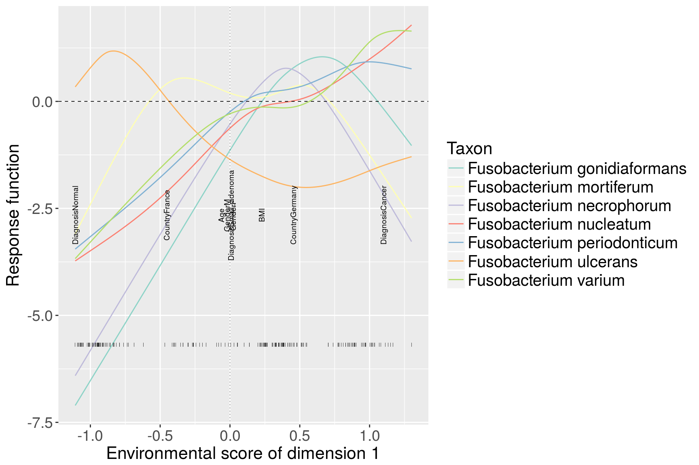

### Assessing the goodness of fit

Also for constrained ordination it can be interesting to use the deviance residuals. We can use them in the unconstrained case by summing over taxa or samples, or plot them versus the environmental gradient to detect lack of fit for the shape of the response function. For this latter goal we provide two procedures: a diagnostic plot of the taxa with the strongest response to the environmental gradient, or an automatic trend detection using the runs test statistic by Ward and Wolfowitz. Checking the linearity (or Gaussian) assumption of the response function is crucial: excessive departure invalidate the interpretation of the ordination plot.

A deviance residual plot for the strongest responders, made with the *residualPlot* function, specified through the *numTaxa* argument

``` r
residualPlot(ZellerRCM2constr, whichTaxa = "response", numTaxa = 6)
```

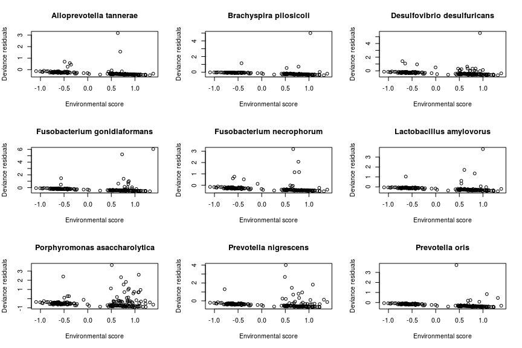

The same taxa but with Pearson residuals

``` r
residualPlot(ZellerRCM2constr, whichTaxa = "response", resid = "Pearson", numTaxa = 6)
```

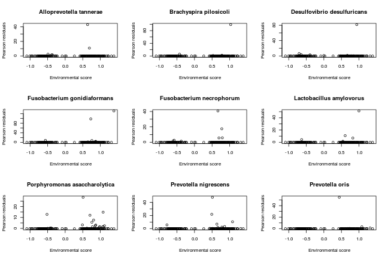

Most species do not exhibit any obvious pattern, although departures seem to increase with environmental scores.

The runs test is a test that automatically attempts to detect non randomness in the sequence of positive and negative residuals. We plot the residual plots for the taxa with the largest run statistic (since the sample sizes and null distributions are equal this corresponds with the smallest p-values, but we do not do inference here because of the non-classical framework).

``` r
residualPlot(ZellerRCM2constr, whichTaxa = "runs", resid = "Deviance", numTaxa = 6)
```

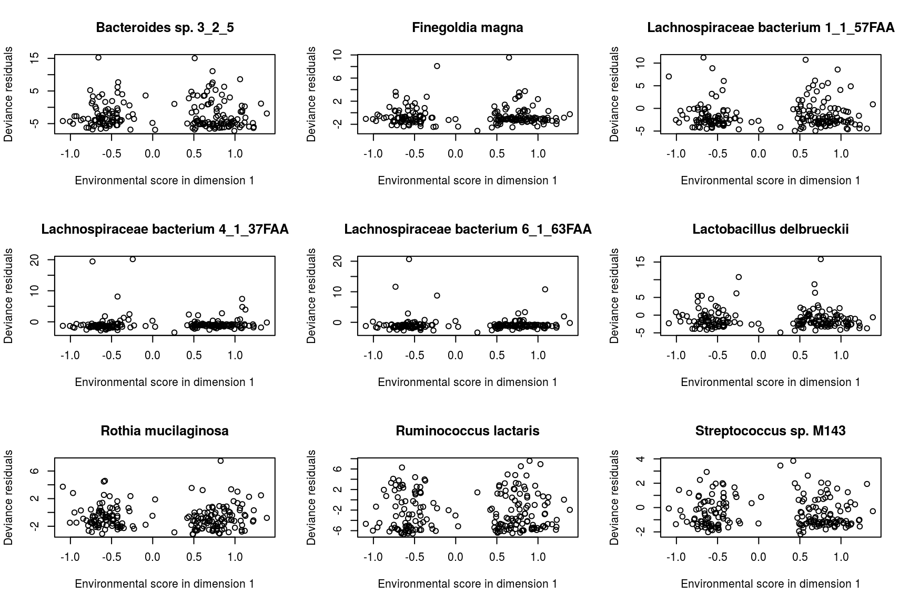

For these 6 taxa we see no signal at all.

### Identifying influential observations

It can also be interesting to identify samples have the strongest influence on the environmental gradient. For this aim we can colour the samples by influence, by specifying *Influence = TRUE*.

``` r
plot(ZellerRCM2constr, plotType = c("variables", "samples"), Influence = TRUE, 
    samColour = "Age")
```

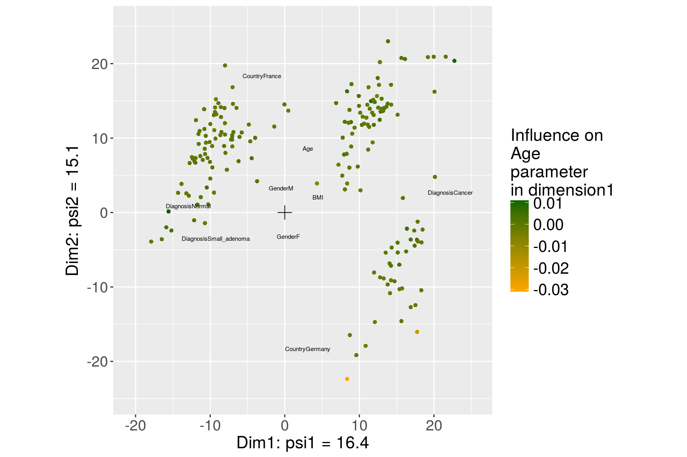

Below we see a couple of very influential observations. They may be very young?

``` r
plot(ZellerRCM2constr, plotType = c("variables", "samples"), samColour = "Age")
```

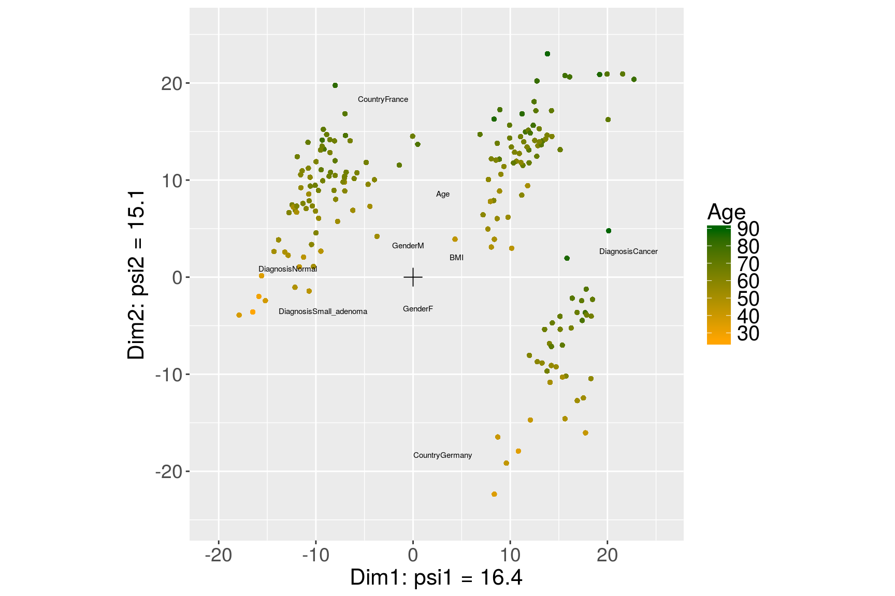

Indeed, a few young subjects affect the estimation of the age parameter most. One should always be wary of these kind of influential observations that strongly affect the ordination. The age coefficient is largest in the second dimension actually, let's look at the influence on that component

``` r
plot(ZellerRCM2constr, plotType = c("variables", "samples"), samColour = "Age", 
    Influence = TRUE, inflDim = 2)
```

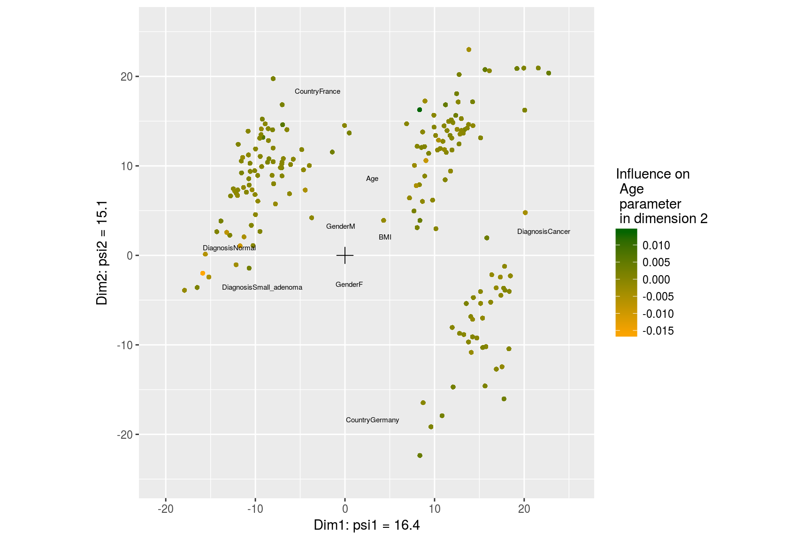
