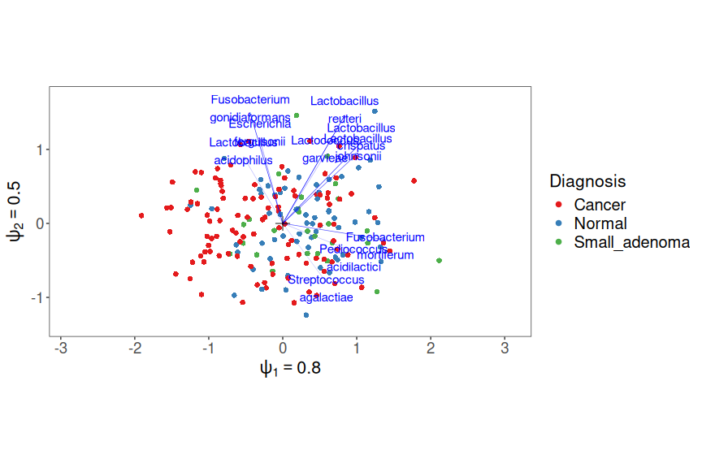
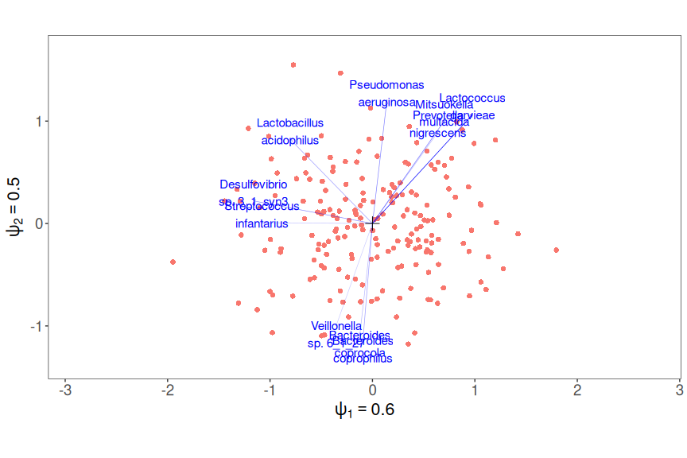
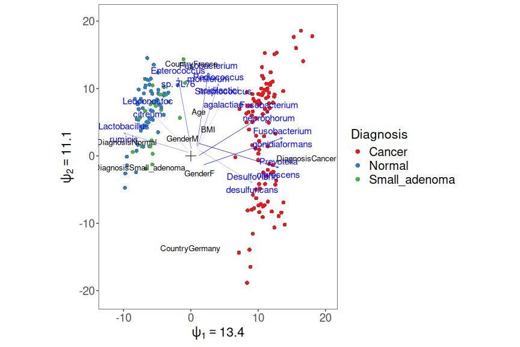
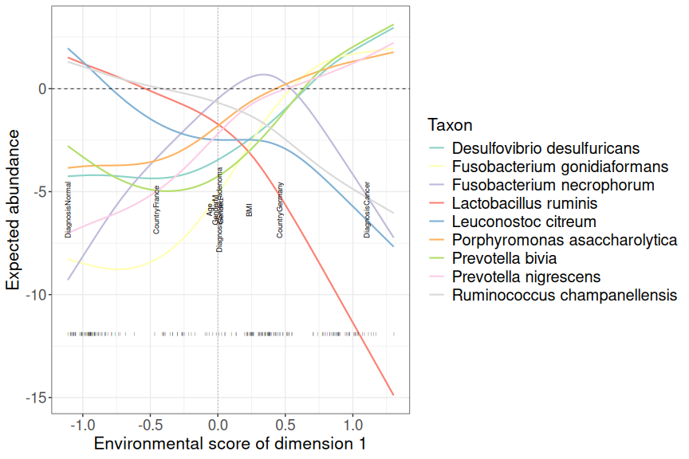

Manual for the use of the RCM functions
=======================================

Publication
-----------

The underlying method of the RCM package is described in detail in the following article: ["A unified framework for unconstrained and constrained ordination of microbiome read count data"](https://journals.plos.org/plosone/article?id=10.1371/journal.pone.0205474).

Install and load packages
-------------------------

This repo contains R-code to fit and plot the RC(M)-models augmented with the negative binomial. The basic usage is demonstrated here, for more advanced examples see the [RCM manual](http://users.ugent.be/~shawinke/RCMmanual) and the help pages of *RCM()*, *RCM\_NB()*, and *plot.RCM()* functions.

The package can be installed and loaded using the following commands:

``` r
library(devtools)
install_github("CenterForStatistics-UGent/RCM")
```

``` r
library(RCM)
```

    ## Registered S3 methods overwritten by 'ggplot2':
    ##   method         from 
    ##   [.quosures     rlang
    ##   c.quosures     rlang
    ##   print.quosures rlang

    ## Registered S3 method overwritten by 'xts':
    ##   method     from
    ##   as.zoo.xts zoo

    ## Registered S3 method overwritten by 'quantmod':
    ##   method            from
    ##   as.zoo.data.frame zoo

``` r
cat("RCM package version", as.character(packageVersion("RCM")), "\n")
```

    ## RCM package version 1.0.2

Dataset
-------

As example data we use a study on the microbiome of colorectal cancer patients "Potential of fecal microbiota for early-stage detection of colorectal cancer" (2014) by Zeller *et al.*.

``` r
library(phyloseq)
data(Zeller)
```

The *Zeller* object is a phyloseq object, which contains all the information of a microbiome experiment. The *RCM* package is tailor-made for phyloseq objects. We therefore strongly recommend building a phyloseq object out of your data, and feeding that object into the *RCM()* function. More information on building the phyloseq object can be found [here](http://joey711.github.io/phyloseq/import-data.html).

Unconstrained RCM
-----------------

### Fitting the unconstrained RCM model

The unconstrained RC(M) method represents all variability present in the data, regardless of covariate information. It should be used as a first step in an exploratory analysis. The *RCM* function is the front end function for this purpose, behind it is the *RCM\_NB* function that does the hard work but requires numeric matrix imputs. We apply it to the Zeller data.

``` r
ZellerRCM2 = RCM(Zeller)
```

which took 1.6 minutes.

### Plotting the unconstrained RCM

A simple plot-command will yield a plot of the RCM ordination

``` r
plot(ZellerRCM2)
```


Samples are represented by dots, taxa by arrows. Both represent vectors with the origin as starting point.

Valid interpretatations are the following:

-   Samples (endpoints of sample vectors, the red dots) close together have a similar taxon composition
-   Taxa are more abundant than average in samples to which their arrows point, and less abundant when their arrows point away from the samples. For example Fusobacterium mortiferum is more abundant than average in samples on the left side of the plot, and more abundant in samples on the right side.
-   The importance parameters *ψ* shown for every axis reflect the relative importance of the dimensions

Distances between endpoints of taxon vectors are meaningless.

The plot can be made more interpretable by adding some colour, e.g. by colouring the samples by cancer diagnosis. For this one can simply provide the name of the sample variable as present in the phyloseq object. For more plotting options see *?plot.RCM*.

``` r
plot(ZellerRCM2, samColour = "Diagnosis")
```



Any richness measure defined in the *phyloseq* package (see *?estimateRichness*) can also be supplied as sample colour.

``` r
plot(ZellerRCM2, samColour = "Shannon")
```


#### Conditioning

In order to condition on certain variables, supply their names to the *confounders* argument. Here we condition on the *country* variable

``` r
ZellerRCM2cond = RCM(Zeller, confounders = "Country")
```

Conditioning can be applied for unconstrained as well as constrained RCM, the ensuing plots have exactly the same interpretationas before, except that all variability attributable to the confounding variables has been removed.

``` r
plot(ZellerRCM2cond)
```



Constrained RCM
---------------

In this second step we look for the variability in the dataset explained sample-specific variables. This should be done preferably only with variables that are believed to have an impact on the species' abundances. Here we used the variables age, gender, BMI, country and diagnosis in the gradient. In this analysis all covariates values of a sample are projected onto a single scalar, the *environmental score* of this sample. The projection vector is called the *environmental gradient*, the magnitude of its components reveals the importance of each variable. The taxon-wise response functions then describe how the logged mean abundance depends on the environmental score.

### Fitting the constrained RCM model

In order to request a constrained RCM fit it suffises to supply the names of the constraining variables to the *covariates* argument. The shape of the response function can be either "linear", "quadratic" or "nonparametric" and must be provided to the *responseFun* argument. Here we illustrate the use of linear and nonparametric response functions. Linear response functions may be too simplistic, they have the advantage of being easy to interpret (and plot). Non-parametric ones (based on splines) are more flexible but are harder to plot.

``` r
# Linear
ZellerRCM2constr = RCM(Zeller, covariates = c("Age", "Gender", "BMI", "Country", 
    "Diagnosis"), responseFun = "linear")
# Nonparametric
ZellerRCM2constrNonParam = RCM(Zeller, covariates = c("Age", "Gender", "BMI", 
    "Country", "Diagnosis"), responseFun = "nonparametric")
```

#### Biplots

In the constrained case two different biplots are meaningful: sample-taxon biplots and variable-taxon biplots.

##### Sample-taxon biplot

``` r
plot(ZellerRCM2constr, plotType = c("species", "samples"))
```


The interpretation is similar as before: the orthogonal projection of a taxon's arrow on a sample represents the departure from independence for that taxon in that sample, *explained by environmental variables*. New is also that the taxa arrows do not start from the origin, but all have their own starting point. This starting point represents the environmental scores for which there is no departure from independence. The direction of the arrow then represents in which direction of the environmental gradient its expected abundance increases.

##### Variable-taxon biplot

``` r
plot(ZellerRCM2constr, plotType = c("species", "variables"))
```


The projection of species arrows on environmental variables (starting from the origin) represents the sensitivity of this taxon to changes in this variables. E.g. Pseudomonas fluorescens is much more abundant in healthy and small adenoma patients than in cancer patients. Note that the fact that the arrows of BMI and gender are of similar length indicates that one *standard deviation* in BMI has a similar effect to gender.

We observe that country and diagnosis are the main drivers of the environmental gradient. We also see that healthy and small adenoma patients have similar taxon compositions, which are very different from the taxon composition of cancer patients.

#### Triplot: linear response functions

Triplots combine all the three components in a single plot. This is the default behaviour of the *plot.RCM* function.

``` r
plot(ZellerRCM2constr, samColour = "Diagnosis")
```



Note that the samples and the environmental variables cannot be related to each other, but the sample-taxon and variable-taxon relationships discussed before are still valid on the triplot.

#### Triplot: Non-parametric response functions

For the non-parametric response functions we can only plot one dimensional triplots, whereby the shape of the response functions of the most strongly reacting taxa is shown. For this we use the *plotRespFun* function.

``` r
plotRespFun(ZellerRCM2constrNonParam)
```



The first dimension is shown by default, the environmental scores of the samples are shown below as ticks, the y-axis shows the response functions of the 8 most reacting species, whereby the x-axis represents the independence model. This graph demonstrates the power of non-parametric response function modelling to unravel differences in species niches.

This document covers only the more basic use of the RCM plotting functions. Discover more advanced features in the [RCM manual](http://users.ugent.be/~shawinke/RCMmanual) or in the help pages of the functions used.
