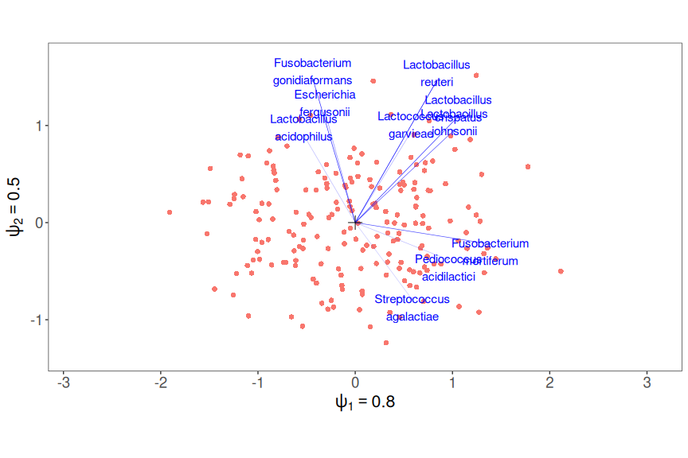

A manual for the use of the RCM functions
=========================================

This repo contains R-code to fit and plot the RC(M)-models augmented with the negative binomial. The functions used for simulation but which are outside outside the core RC(M) algorithm are present in the "pubFun" folder.

The package can be installed using the following commands:

``` r
library(devtools)
install_github("CenterForStatistics-UGent/RCM")
```

    ## Skipping install of 'RCM' from a github remote, the SHA1 (c58f0f6e) has not changed since last install.
    ##   Use `force = TRUE` to force installation

``` r
library(RCM)
cat("RCM package version", as.character(packageVersion("RCM")), "\n")
```

    ## RCM package version 0.1.0

``` r
library(phyloseq)
```

Manual
------

Here follows a short tutorial on fitting and plotting the RCM model.

Dataset
-------

As example data we use a study on the microbiome of colorectal cancer patients "Potential of fecal microbiota for early-stage detection of colorectal cancer" (2014) by Zeller *et al.*.

``` r
data(Zeller)
```

Unconstrained RCM
-----------------

The unconstrained RC(M) method represents all variability present in the data, regardless of covariate information. It should be used as a first step in an exploratory analysis. We fit a model with two dimensions, which takes a few minutes.

``` r
if (!file.exists(file = "./results/ZellerRCM2.RData")) {
    ZellerRCM2 = RCM(Zeller, k = 2, round = TRUE)
    save(ZellerRCM2, file = "./results/ZellerRCM2.RData")
} else {
    load(file = "./results/ZellerRCM2.RData")
}
```

The runtime was 0.8 minutes to be exact. We plot the result of this ordination in a biplot, beginning with the samples.

``` r
plot(ZellerRCM2, plotType = "samples")
```


No clear signal is present at first sight. Note also that the plot is rectangular according to the values of the importance parameters *ψ*. In order to truthfully represent the distances between samples all axis must be on the same scale. We can add a colour code for the cancer diagnosis contained in the phyloseq object.

``` r
plot(ZellerRCM2, plotType = "samples", samColour = "Diagnosis")
```


It is clear that some of the variability of the samples is explained by the cancer status of the patients.

We can also add a richness measure as a colur, see ?phyloseq::estimate\_richness for a list of available richness measures. Here we plot the Shannon diversity

``` r
plot(ZellerRCM2, plotType = "samples", samColour = "Shannon")
```


Next we plot only the species.

``` r
plot(ZellerRCM2, plotType = "species")
```


The researchers found that species from the Fusobacteria genus are associated with cancer. We can plot only these species using a regular expression.

``` r
plot(ZellerRCM2, plotType = "species", taxRegExp = "Fusobacter", taxLabels = TRUE)
```


It is clear that these Fusobacterium species behave very differently between the species. We can also colour the species plots by phylogenetic level, e.g. order level, if available in the dataset.

``` r
plot(ZellerRCM2, plotType = "species", taxLabels = TRUE, taxCol = "Order")
```

Finally we can combine both plots into an interpretable biplot, which is the default for unconstrained RC(M). To avoid overplotting we only show the taxa with the 10 most important departures from independence.

``` r
plot(ZellerRCM2, taxNum = 10, samColour = "Diagnosis")
```



Samples are represented by dots, taxa by arrows. Both represent vectors with the origin as starting point.

Valid interpretatations are the following:

-   Samples (endpoints of sample vectors, the red dots) close together depart from independence in a similar way
-   The orthogonal projection of the taxon arrows on the sample arrows are proportional to the departure from independence of that taxon in that sample on the log scale, in the first two dimensions. For example Fusobacterium mortiferum is more abundant than average in samples on the left side of the plot, and more abundant in samples on the right side.
-   The importance parameters *ψ* shown for every axis reflect the relative importance of the dimensions

Distances between endpoints of taxon vectors are meaningless.

We can also graphically highlight the departure from independence for a particular taxon and sample as follows:

``` r
tmpPlot = plot(ZellerRCM2, taxNum = 10, samColour = "Diagnosis", returnCoords = TRUE)
addOrthProjection(tmpPlot, species = "Alloprevotella tannerae", sample = c(-1.2, 
    1.5))
```


The projection of the species vector is graphically shown here, the orange bar representing the extent of the departure from independence. Note that we providid the exact taxon name, and approximate sample coordinates visually derived from the graph, but any combination of both is possible.

### Adding dimensions

Since the model is fitted dimension per dimension, we only have information on the first two dimension. If we want to add a third dimension, we do not have to start from scratch but can use the previously fitted model in two dimension as a starting point and additionally estimate the third dimension.

``` r
if (!file.exists(file = "./results/ZellerRCM3.RData")) {
    ZellerRCM3 = RCM(Zeller, prevFit = ZellerRCM2, k = 3, round = TRUE)
    save(ZellerRCM3, file = "./results/ZellerRCM3.RData")
} else {
    load(file = "./results/ZellerRCM3.RData")
}
```

The total runtime for all dimensions combined was 2.3 minutes. We can then plot any combination of two dimensions we want, e.g. the first and the third.

``` r
plot(ZellerRCM3, Dim = c(1, 3), samColour = "Diagnosis", taxNum = 6)
```


The third dimension also correlates with a separation of cancer patients vs. healthy and small adenoma patients.

### Assessing the goodness of fit

Some taxa (or samples) may not follow a negative binomial distribution, or their departures from independence may not be appropriately represented in low dimensions. We visualize these taxa and samples through their deviances, which are the squared sums of their deviance residuals. This allows us to graphically identify taxa and samples that are poorly represented in the current ordination.

The deviance residuals can be extracted manually

``` r
devResiduals = RCM:::getDevianceRes(ZellerRCM2, Dim = c(1, 2))
```

but you can also just supply the argument "Deviance" to samColour

``` r
plot(ZellerRCM2, plotType = "samples", samColour = "Deviance", samSize = 2.5)
```


Samples with the largest scores exhibit the poorest fit. This may indicate that samples with strong departures from independence acquire large scores, but still are not well represented in lower dimensions. Especially the one bottom right may be a problematic case.

We again also use the third dimension, maybe this sample is fitted well there?

``` r
plot(ZellerRCM3, plotType = "samples", samColour = "Deviance", samSize = 2.5, 
    Dim = c(1, 3))
```


No the problem persists there.

The same principle can be applied to the taxa

``` r
plot(ZellerRCM3, plotType = "species", taxCol = "Deviance", samSize = 2.5, Dim = c(1, 
    2), arrowSize = 0.5)
```


For the taxa it appears to be the taxa with smaller scores are the more poorly fitted ones. Note that since the count table is not square, we cannot compare sample and taxon deviances. They have not been calculated based on the same number of taxa. Also, one cannot do chi-squared tests based on the deviances since this is not a classical regression model, but an overparametrized one.

Constrained analysis
--------------------

In this second step we look for the variability in the dataset explained by linear combinations of covariates that maximally separate the niches of the species. This should be done in a second step, and preferably only with variables that are believed to have an impact on the species' abundances. Here we used the variables age, gender, BMI, country and diagnosis in the gradient. In this analysis all covariates values of a sample are projected onto a single scalar, the environmental score of this sample. The projection vector is called the environmental gradient, the magnitude of its components reveals the importance of each variable. The taxon-wise response functions then describe how the logged mean abundance depends on the environmental score.

### Linear response functions

Even though these response functions may be too simplistic, they have the advantage of being easy to interpret (and plot).

``` r
if (!file.exists(file = "./results/ZellerRCM2constr.RData")) {
    ZellerRCM2constr = RCM(Zeller, k = 2, round = TRUE, covariates = c("Age", 
        "Gender", "BMI", "Country", "Diagnosis"), responseFun = "linear")
    save(ZellerRCM2constr, file = "./results/ZellerRCM2constr.RData")
} else {
    load(file = "./results/ZellerRCM2constr.RData")
}
```

First we plot the samples

``` r
plot(ZellerRCM2constr, plotType = c("samples"))
```


In the constrained analysis we clearly see three groups of samples appearing.

``` r
plot(ZellerRCM2constr, plotType = c("samples"), samColour = "Diagnosis")
```


One group are the healthy patients, the other two are cancer patients.

``` r
plot(ZellerRCM2constr, plotType = c("samples"), samColour = "Country")
```


The cancer patients are separated by country. Note that from Germany there are only cancer patients in this dataset.

Now we add the species to make a biplot

``` r
plot(ZellerRCM2constr, plotType = c("species", "samples"))
```


The interpretation is similar as before: the orthogonal projection of a taxon's arrow on a sample represents the departure from independence for that taxon in that sample, *explained by environmental variables*. New is also that the taxa arrows do not start from the origin, but all have their own starting point. This starting point represents the environmental scores for which there is no departure from independence. The direction of the arrow then represents how its expected abundance increases. Again we can show this visually:

``` r
tmpPlot2 = plot(ZellerRCM2constr, plotType = c("species", "samples"), returnCoords = TRUE)
addOrthProjection(tmpPlot2, species = "Pseudomonas fluorescens", sample = c(-12, 
    7))
```


Note that the projection bar does not start from the origin in this case either.

Next we can make a biplot of taxa and environmental variabless.

``` r
plot(ZellerRCM2constr, plotType = c("species", "variables"))
```


The projection of species arrows on environmental variables (starting from the origin) represents the sensitivity of this taxon to changes in this variables. Note that the fact that the arrows of BMI and gender are of similar length indicates that one *standard deviation* in BMI has a similar effect to gender.

Also this interpretation we can show visually on the graph

``` r
tmpPlot3 = plot(ZellerRCM2constr, plotType = c("species", "variables"), returnCoords = TRUE)
addOrthProjection(tmpPlot3, species = "Pseudomonas fluorescens", variable = "DiagnosisSmall_adenoma")
```


We observe that country and diagnosis are the main drivers of the environmental gradient. We also see that healthy patients are very similar to small adenoma patients, but that they are very different from cancer patients.

To finish we also show the triplot, which unites all the information of the ordination:

``` r
plot(ZellerRCM2constr)
```


Note that the samples and the environmental variables cannot be related to each other.

#### Assessing the goodness of fit

Also for constrained ordination it can be interesting to use the deviance residuals. We can use them in the unconstrained case by summing over taxa or samples, or plot them versus the environmental gradient to detect lack of fit for the shape of the response function. For this latter goal we provide two procedures: a diagnostic plot of the taxa with the strongest response to the environmental gradient, or an automatic trend detection using the runs test statistic by Ward and Wolfowitz. Checking the linearity (or Gaussian) assumption of the response function is crucial: excessive departure invalidate the interpretation of the ordination plot.

A deviance residual plot for the strongest responders

``` r
residualPlot(ZellerRCM2constr, whichTaxa = "response")
```


The same taxa but with Pearson residuals

``` r
residualPlot(ZellerRCM2constr, whichTaxa = "response", resid = "Pearson")
```


Most species do not exhibit any obvious pattern, although departures seem to increase with environmental scores.

The runs test is a test that automatically attempts to detect non randomness in the sequence of positive and negative residuals. We plot the residual plots for the taxa with the largest run statistic (since the sample sizes and null distributions are equal this corresponds with the smallest p-values, but we do not do inference here because of the non-classical framework).

``` r
residualPlot(ZellerRCM2constr, whichTaxa = "runs", resid = "Deviance")
```


``` r
residualPlot(ZellerRCM2constr, whichTaxa = "runs", resid = "Pearson")
```


For these taxa we see no signal at all.

#### Identifying influential observations

It can also be interesting to see which samples have the strongest influence on the environmental gradient.

``` r
inflArr = RCM:::NBalphaInfl(ZellerRCM2constr, Dim = 1)
```

Say we want to know which samples have on average the largest influence on the estimation of the age parameter.

``` r
plot(ZellerRCM2constr, plotType = c("variables", "samples"), samColour = rowSums(inflArr[, 
    , "Age"]), colLegend = "Influence on Age parameter in dimension 1")
```


Below we see a couple of very influential observations. They may be very young?

``` r
plot(ZellerRCM2constr, plotType = c("variables", "samples"), samColour = "Age")
```


Indeed, a few young subjects affect the estimation of the age parameter most. One should always be wary of these kind of "outliers" that strongly affect the ordination.

We can achieve the same plots by using the "influence" flag in the plotting function.

``` r
plot(ZellerRCM2constr, plotType = c("variables", "samples"), samColour = "Age", 
    Influence = TRUE)
```


The age coefficient is largest in the second dimension actually, let's look at the influence on that component

``` r
plot(ZellerRCM2constr, plotType = c("variables", "samples"), samColour = "Age", 
    Influence = TRUE, inflDim = 2)
```


One last illustration: which samples have the strongest impact on the "DiagnosisCancer" parameter

``` r
plot(ZellerRCM2constr, plotType = c("variables", "samples"), samColour = "DiagnosisCancer", 
    Influence = TRUE, samShape = "Diagnosis", samSize = 2)
```


French cancer patients appear to have the strongest impact.

### Non-parametric response functions

These response functions are very data driven, but have the drawback that they do not allow to visualize the role of the taxa in the ordination.

``` r
if (!file.exists(file = "./results/ZellerRCM2constrNonParam.RData")) {
    ZellerRCM2constrNonParam = RCM(Zeller, round = TRUE, k = 2, covariates = c("Age", 
        "Gender", "BMI", "Country", "Diagnosis"), responseFun = "nonparametric")
    save(ZellerRCM2constrNonParam, file = "./results/ZellerRCM2constrNonParam.RData")
} else {
    load(file = "./results/ZellerRCM2constrNonParam.RData")
}
```

``` r
plot(ZellerRCM2constrNonParam, plotType = "samples")
```


Using non-parametric response functions we do not find the same clear clusters

``` r
plot(ZellerRCM2constrNonParam, plotType = "samples", samColour = "Diagnosis")
```


Show the variables

``` r
plot(ZellerRCM2constrNonParam, plotType = "variables")
```


The envrionmental gradients are quite different from the case with the linear response functions. Especially age is an important driver of the environmental gradient here. Still the results for cancer diagnosis, country and gender are similar to before.

#### Looking at the species' response function

The advantage of the non-parametric response functions is that we can get a good, fine-grained understanding of how species react to the environmental gradient. Let's have a look at the response function of a random subset of 8 taxa in the first dimension

``` r
set.seed(684584)
taxaDrawn = sample(taxa_names(ZellerRCM2constrNonParam$physeq), 8)
plotRespFun(ZellerRCM2constrNonParam, Dim = 1, taxa = taxaDrawn)
```


Here we see e.g. that *Succinatimonas hippei* is more abundant than under the independence model for low values of the environmental score, but less abundant for high values. The gradient in this dimension is clearly dominated by the cancer diagnosis. Let us have a look at how *Fusobacterium* species react to this gradient, as the authors found them to be more abundant in cancer patients .

``` r
FusoSpecies = grep("Fusobacterium", value = TRUE, taxa_names(ZellerRCM2constrNonParam$physeq))
plotRespFun(ZellerRCM2constrNonParam, Dim = 1, taxa = FusoSpecies, samShape = "Diagnosis")
```


Not all Fusobacteria react to the environmental gradient in the same way.

We can do the same for the second dimension, which is dominated by age

``` r
plotRespFun(ZellerRCM2constrNonParam, Dim = 2, taxa = taxaDrawn, samShape = "Diagnosis")
```


